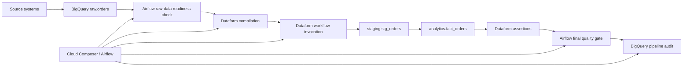

# GCP Data Pipeline Demo

A compact, production-oriented example of an ELT pipeline built with **Cloud Composer / Apache Airflow**, **Dataform**, and **BigQuery**.

The repository is intentionally small enough to walk through live in 15–20 minutes, while still showing the patterns that matter in production: incremental processing, late-arriving data, deduplication, idempotency, data quality checks, partition pruning, monitoring, and backfills.

> This is a standalone demonstration project. It contains no employer code, credentials, internal names, or production data.

## Architecture



## What the example demonstrates

- **Composer / Airflow orchestration** with retries, timeouts, single active run, labels, and failure logging.
- **Dataform incremental models** using `uniqueKey`, source pruning, and target partition pruning.
- **Late-arriving data handling** with a rolling reprocessing window.
- **Deterministic deduplication** using `ROW_NUMBER()`.
- **BigQuery cost controls** through partitioning, clustering, and bounded incremental scans.
- **Data quality** through Dataform assertions and a final Airflow quality gate.
- **Operational recovery** through an explicit backfill procedure.
- **Auditing** by writing successful pipeline runs to a BigQuery audit table.

## Repository structure

```text
.
├── dags/
│   └── gcp_orders_pipeline.py
├── dataform/
│   ├── workflow_settings.yaml
│   └── definitions/
│       ├── sources/raw_orders.sqlx
│       ├── staging/stg_orders.sqlx
│       ├── marts/fact_orders.sqlx
│       └── assertions/assert_no_negative_revenue.sqlx
├── sql/bootstrap/
│   ├── create_raw_orders.sql
│   └── load_sample_orders.sql
├── docs/
│   ├── operations.md
│   └── interview-walkthrough.md
├── tests/
│   └── test_sources_compile.py
└── .github/workflows/ci.yml
```

## Data flow

### 1. Raw events

`raw.orders` stores append-only order events. A source can resend an event, and events can arrive late.

Important fields:

- `event_id`: idempotency key from the source;
- `order_id`: business entity key;
- `event_type`: `CREATED`, `PAID`, or `CANCELLED`;
- `event_ts`: business event time;
- `ingested_at`: warehouse arrival time.

### 2. Staging model

`staging.stg_orders`:

- keeps the latest copy of each `event_id`;
- reprocesses recently ingested records;
- merges by `event_id`;
- limits target-table scanning to recent partitions;
- validates keys, timestamps, event types, and amounts.

### 3. Mart model

`analytics.fact_orders` creates one current record per `order_id`. Only orders affected by recently ingested events are recalculated during an incremental run.

### 4. Final quality gate

Airflow checks that the mart:

- contains data;
- has one row per order;
- has no null business keys;
- has no negative revenue.

## Configuration

Replace the placeholder values in `dataform/workflow_settings.yaml` and configure these environment variables in Composer:

| Variable | Example | Purpose |
|---|---|---|
| `GCP_PROJECT_ID` | `demo-analytics-project` | BigQuery and Composer project |
| `BQ_LOCATION` | `US` | BigQuery dataset location |
| `DATAFORM_REGION` | `us-central1` | Dataform repository region |
| `DATAFORM_REPOSITORY_ID` | `gcp-data-pipeline-demo` | Dataform repository ID |
| `RAW_DATASET` | `raw` | Raw source dataset |
| `MART_DATASET` | `analytics` | Final mart dataset |
| `AUDIT_DATASET` | `ops` | Operational audit dataset |
| `DATAFORM_GIT_COMMITISH` | `main` | Git branch or commit compiled by Dataform |

The Airflow service account needs only the permissions required to invoke Dataform and run the validation/audit BigQuery jobs. The Dataform execution service account should own the BigQuery transformation permissions.

## Bootstrap sample data

Run the SQL files in this order:

```text
sql/bootstrap/create_raw_orders.sql
sql/bootstrap/load_sample_orders.sql
```

Update `demo-analytics-project` before execution.

## Backfill strategy

For an ordinary late-data recovery, run the DAG for the affected date after increasing the rolling window only when needed.

For a controlled full rebuild:

1. pause downstream consumers;
2. create a backup or snapshot of the affected mart;
3. run a Dataform workflow invocation with full refresh enabled for selected incremental actions;
4. run all assertions and the Airflow quality gate;
5. compare row counts and business totals;
6. resume downstream consumers.

The staging model is marked `protected: true`, so an accidental full refresh is blocked. Remove that protection only as part of an approved recovery procedure.

## Cost considerations

- Raw and staging tables are partitioned by event date.
- Incremental source reads use `ingested_at` to capture late arrivals.
- `updatePartitionFilter` limits target partitions scanned by Dataform during `MERGE`.
- `fact_orders` recalculates only affected order IDs.
- Airflow quality checks scan only recent partitions where possible.
- BigQuery labels identify the demo pipeline in job history and billing analysis.

For very large backfills, run a separate bounded backfill DAG rather than widening the daily window permanently.

## CI

The GitHub Actions workflow performs dependency-free syntax checks for Python and validates that the expected project files exist. Composer and Dataform integration tests should run in a non-production GCP project.

## Live walkthrough

A suggested interview walkthrough is available in [`docs/interview-walkthrough.md`](docs/interview-walkthrough.md).
